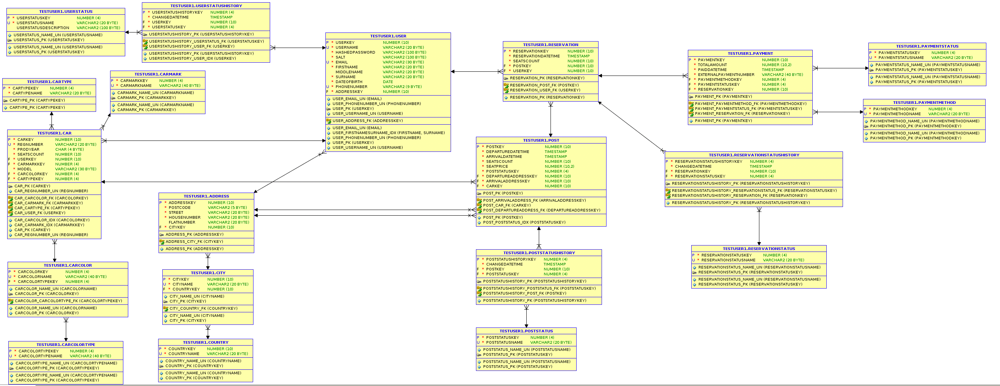

# oracle-db-project
Project for oracle db classes.

# Pytania

# TODO
1. ~~Dodać rodzaj do koloru (CarColorType). DONE~~
2. ~~Dodać BlaBlaUserStatus z historią. DONE~~
3. ~~Dodać historię do PostStatus. DONE~~
4. ~~Zmienic BlaBlaUser na cos krotszego. DONE~~
5. Dodac cos ala externalPaymentNumber do platnosci, w razie co zeby to zewnetrzny system obslugiwal platnosc a nasz system przechowywal id tej platnosci a system jako rodzaj platnosci.-**adam**
6. ~~Moze zmieniec travel i payment tak zeby to payment przechowywal informacje o travelKey (postKey, userKey). DONE~~
7. Dodac pole model do Car. -**adam**
8. Dodac tabele CarType np Bus, Osobowy, ciezarowy, limuzyna. -**magda**
9.  DOdac status do Travel i jego historie. -**kamil**
10. ~~Zmiana nazwy z Travel na Reservation -**kamil** DONE~~
11. ~~Dodac reservationDateTime do Travel. -**kamil** DONE~~
12. Zaktualizowac status Post (wypelnienie danymi).
13. Dodać NOT NULLe -**adam**
14. Dodanie indexów
# Other options
1. Dodac system rabatow, moze tabele Promo i userom by sie przypisywalo rabaty do wykorzystania przy platnosic.
# Nieaktualny model

